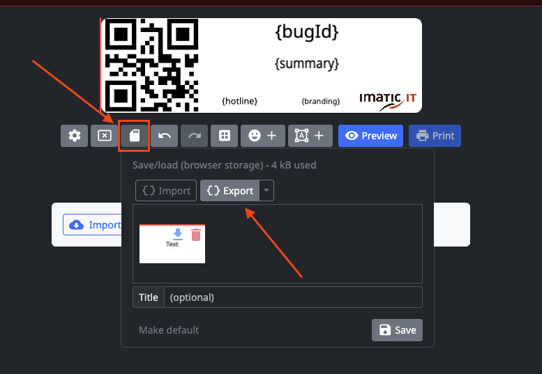

# IMATIC NIIMBLUE FEATURES

# Fork of niimblue with Imatic GitHub Template Import Feature

This project is a fork of [niimblue](https://github.com/MultiMote/niimblue) with a customized `LabelDesigner.svelte` component and additional features to streamline label template management.

---

## Features

- **Forked from niimblue** with modifications in `LabelDesigner.svelte`.
- **Fetches templates dynamically from GitHub** — no more manual downloads and imports.
- Uses GET parameters from Mantis to fetch template data.
- Added a new component: `ImaticGithubTemplatePicker.svelte`.
  - This feature allows importing example label templates directly from a GitHub repository.
  - Speeds up template setup by eliminating manual file handling.
- Supports both:
  - Fetching templates directly from the GitHub repo.
  - Manual import by downloading `.json` files from the repo if preferred.
- **New: Push edited templates back to GitHub** directly from the app.
- **New: Save current template as a new file in the GitHub repository** without leaving the interface.

---

## Environment Variables

To enable GitHub integration, add the following variables to your `.env` file:

```env
VITE_GITHUB_REPO_API_URL=https://api.github.com/repos/Imatic-IT/niimblue-templates/contents/
VITE_GITHUB_REPO_RAW_URL=https://raw.githubusercontent.com/Imatic-IT/niimblue-templates/master/
VITE_IMATIC_GITHUB_TOKEN=your_personal_access_token_here
```

- The token is optional but **recommended** for higher rate limits and access to public repositories.
- If you prefer, you can skip the GitHub integration and manually download the `.json` template files from:
  [https://github.com/Imatic-IT/niimblue-templates](https://github.com/Imatic-IT/niimblue-templates)
- After editing or creating a template, commit and push the `.json` file back to the repository **directly from the app** or edit it in the browser using:
  [https://github.dev/Imatic-IT/niimblue-templates](https://github.dev/Imatic-IT/niimblue-templates)

---

## Usage

- Start the app and use the **Load Template From GitHub** button.
- Browse and select a template fetched live from the GitHub repository.
- The selected template loads into the label designer for editing.
- After editing, use the **Push to GitHub** button to commit your changes directly back to the repository.
- Or, use the **Save as New Template** feature to create a new template file in the GitHub repo without overwriting existing ones.
- - **Note:** Pushing changes to GitHub may take a few moments due to network latency and GitHub's API processing times. Please be patient while the operation completes.
- Export your customized template locally (see image below) if you want to keep a local backup.

  

- Alternatively, you can edit and push directly in the browser using GitHub’s web editor here:
  [https://github.dev/Imatic-IT/niimblue-templates](https://github.dev/Imatic-IT/niimblue-templates)


# NiimBlue

NIIMBOT printers webui. Design and print labels right from your browser.

Uses [NiimBlueLib](https://github.com/MultiMote/niimbluelib) for communication.

Project is deployed here: [niim.blue](https://niim.blue)

> [!NOTE]
> If you have printing problems, try different print task versions in print preview dialog. Make if default by pressing "Lock" button.
>
> If you found version suitable for your model, please write [here](https://github.com/MultiMote/niimbluelib/issues/1).
>
> Also read [Frequently asked questions](https://github.com/MultiMote/niimblue/wiki/Frequently-asked-questions).


## Features

Key features:

* Privacy first! This application works completely offline and does not send any data (except for downloading application files and importing ZPL labels). Label data is stored in your browser.
* Support for both Bluetooth and USB connections.
* Rich label editor. Label saving, import/export.
* Print preview. You can see how your label will look like after post-processing. Several post-processing algorithms are available.
* Android App (Capacitor based).
* Most complete implementation of [NIIMBOT protocol](https://niim-docs.pages.dev/documents/NIIMBOT_printers_protocol.html).

You can see the full list of implemented and planned features [on the Wiki](https://github.com/MultiMote/niimblue/wiki#features).

List of tested models you can find in [niimluelib](https://github.com/MultiMote/niimbluelib/issues/1) repository.

Demonstration video:

[](https://www.youtube.com/watch?v=u8QX-5e3W_A)

## Browser support

Your browser must support Web Bluetooth API: [supported browsers](https://developer.mozilla.org/en-US/docs/Web/API/Web_Bluetooth_API#browser_compatibility).

For serial communication: [supported browsers](https://developer.mozilla.org/en-US/docs/Web/API/Web_Serial_API#browser_compatibility).

In some systems you need to enable Chrome `Experimental Web Platform Features` (navigate to `chrome://flags`).

## Feedback needed!

I only have D110 and B1 printers. If you own other models, please write a comment [here](https://github.com/MultiMote/niimbluelib/issues/1) describing your model working or not.

Bluetooth dumps are MUCH appreciated. [How to make it](https://github.com/MultiMote/niimblue/wiki/Making-packet-capture).

## Images

Images may be outdated, interface is changing constantly.


## Launching development server

Skip steps you have done.

1. Install [git](https://git-scm.com)

2. Install [nodejs](https://nodejs.org)

3. Clone repository

    ```bash
    git clone https://github.com/MultiMote/niimblue.git
    ```

4. Install dependencies

    ```bash
    npm i
    ```

5. Run dev server

    Check code and open browser:

    ```bash
    npm run dev-check
    ```

    Or just run:

    ```bash
    npm run dev
    ```

Eslint not included. Install it with:

```bash
npm install --no-save --no-package-lock eslint@9.x globals @types/eslint @eslint/js typescript-eslint eslint-plugin-svelte
```

## Translation status

[](https://weblate.mmote.ru/engage/niimblue/)

## Other

|  Links |    |
|--------| -- |
| [](https://discord.gg/jXPAfZVd8a) | Discord (dev news, troubleshooting and other) |
| [](https://boosty.to/multimote) | Boosty (support project) |

